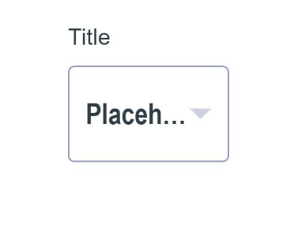
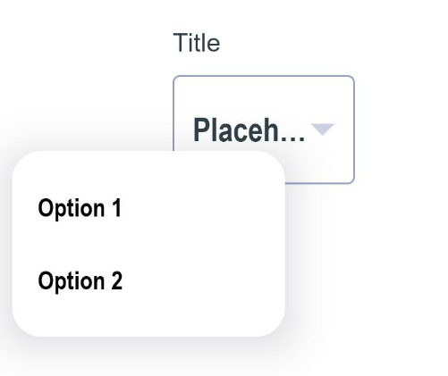
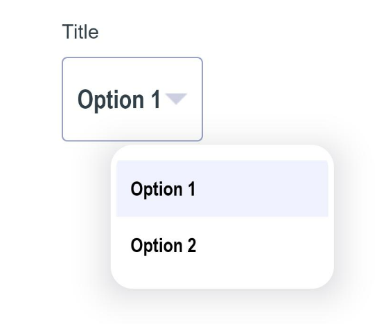
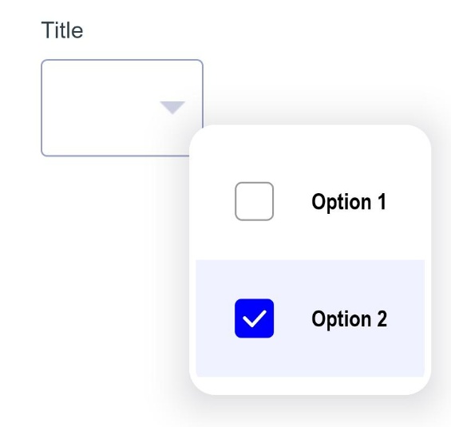

# Material Select

Material Select design in OpenHarmony.

## Download & Install

Install using npm

```npm i material-checkbox```

## Usage Instructions

Material select library provides three types of select boxes:- <br/><br/>
MaterialSelect - Provides single option selection functionality. <br/><br/>
MultipleSelect - Provides multiple option selection functionality. <br/><br/>
DotMenu - Provides dot menu functionality. <br/>

1. Import files and code dependencies

```ets
import { MaterialSelect, MenuOption } from '@ohos/material-select'

import { MultipleSelect, MultipleMenuOption } from '@ohos/material-select'

import { DotMenu, DotMenuOption } from '@ohos/material-select'
```

2. Initialize select model data

```
private singleSelectModel:MaterialSelect.Model = new MaterialSelect.Model('Title', 'Placeholder')

private multipleSelectModel: MultipleSelect.Model = new MultipleSelect.Model('Title')

private dotModel: DotMenu.Model = new DotMenu.Model()
```

3. Initialize select menu model data

```
private singleSelectMenuModel: MaterialSelect.MenuModel = new MaterialSelect.MenuModel()

private multipleSelectMenuModel: MultipleSelect.MenuModel = new MultipleSelect.MenuModel()

private dotMenuModel: DotMenu.MenuModel = new DotMenu.MenuModel()
```

4. Initialize menus for select components

```
private single: MenuOption[] = [
    new MenuOption("Option 1", 1),
    new MenuOption("Option 2", "2")
]

private multiple: MultipleMenuOption[] = [
    new MultipleMenuOption("Option 1", 1),
    new MultipleMenuOption("Option 2", "2", true)
]

private dot: DotMenuOption[] = [
    new DotMenuOption("Preview", 1),
    new DotMenuOption("Download", "2", $r("app.media.download")
]
```

5. Code for creating single selection component

```
MaterialSelect({
    menu: this.single,
    onSelect: (it: MenuOption) => {},
    model: this.singleSelectModel
})
```





6. Code for creating multiple selection component

```
MultipleSelect({
    menu: this.multiple,
    onSelect: (it: MultipleMenuOption[]) => {},
    model: this.multipleSelectModel,
    menuModel: this.singleSelectMenuModel
})
```




6. Code for creating dot menu component

```
DotMenu({
      menu: this.dotMenu,
      onSelect: (it: DotMenuOption) => {},
      model: this.dotModel,
      menuModel: this.dotMenuModel
})
```


## Compatibility

Supports OpenHarmony API version 8

## Code Contribution

## Open source License

This project is based
on [Apache License 2.0](https://github.com/Applib-OpenHarmony/Material_Ui_Checkbox/blob/main/LICENSE), please enjoy and
participate in open source freely.

## Open Issues

1. BorderRadius property in MenuModel does not change the border radius of popup menu.
<br/><br/>
2. Popup menu of MultipleSelect disappears after single click.

# Reference:

Design by : Sarthak Gothalyan